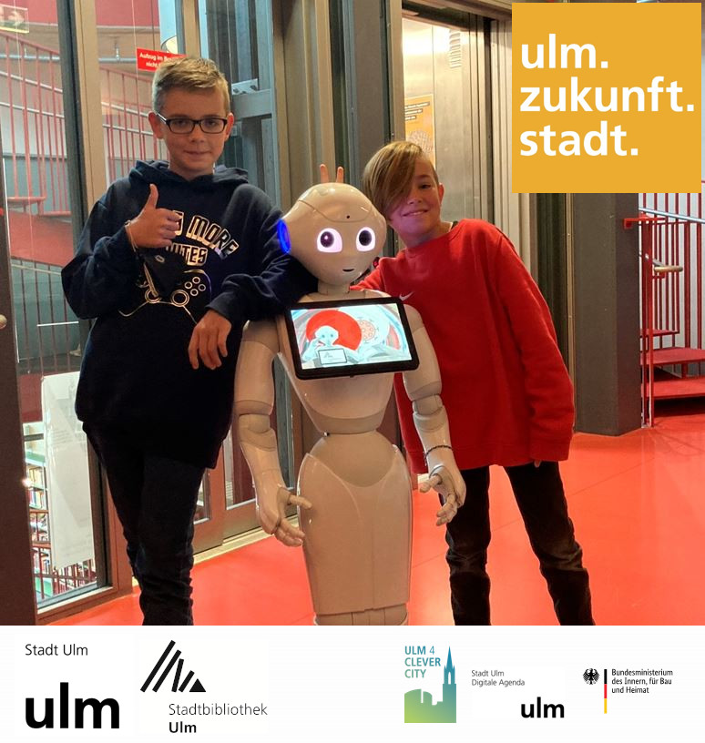

 

  

 

 
  <h2 align="center">Softbank pepper supports our visitors   [navigation with odometrie]</h2>
  
  <!-- ABOUT THE PROJECT -->
  <h3>Introduction</h3>
  
  The aim of the Public Library Ulm is to use robotics to assist citizens and employees in our library.
  For this purpose our humanoid robot shut be able to move autonomously in our central library, among users and visitors. 
  The robot should be able to solve standard tasks autonomously.
  In the medium term, our robot should support the use of library services such as library information, media reseaches and child-friendly offers. 
  In the future, the robot will also provide general urban information and citizen services, such as timetable information, bus stops, etc. to our visitors.
  
  
(<a href="#top">back to top</a>)

  
  <h3>promotion and implementation</h3>
  The project of user support by a humanoid robot was created in cooperation between the Ulm City Library and the Digital Agenda office of the City of Ulm and was  realized with funds from the "Smart Cities made in DE" funding of the Ministry of the Interior, Building and Community (BMI).
  
  
(<a href="#top">back to top</a>)

  <h3>Built With / necessary Hardware</h3>
  <ul>
    <li>Softbank Choregraphe suite (https://developer.softbankrobotics.com/)</li>
    <li>Milk (https://www.python.org/)</li> 
    <li>node-red (https://nodered.org/)</li>
    <li>Softbank Pepper (python-version) </li>
  </ul> 

  
(<a href="#top">back to top</a>)

  <h3>About the Project</h3>
  <b> project goal</b>  
  "Realization of an indoor navigation based on the Softbank Pepper (python-version) ". Limited by the hardware used in the pepper
  

   Through this project, the Public Library Ulm became a pioneer in Germany for the implementation of indoor navigation on a python-based robot Pepper 
   The indoor navigation could be implemented fundamentally 
   Python Pepper was enabled for rudimentary indoor navigation through this pilot project 
   100% reliable navigation could not be realized due to sensor limitations of the hardware platform.  
   Limmitations are for example: Laser scanning points, accuracy of odometry and visual comparison of the environment
    
   
(<a href="#top">back to top</a>)
 
    
   <h3>How was this project developed ?</h3>
   Developed on version 2.5 of NAOqi, Pepper's operating system, this application was developed using the Choregraphe software. 
  
(<a href="#top">back to top</a>)

    
   <h3>Result</h3>
    
 
   
(<a href="#top">back to top</a>)

   

